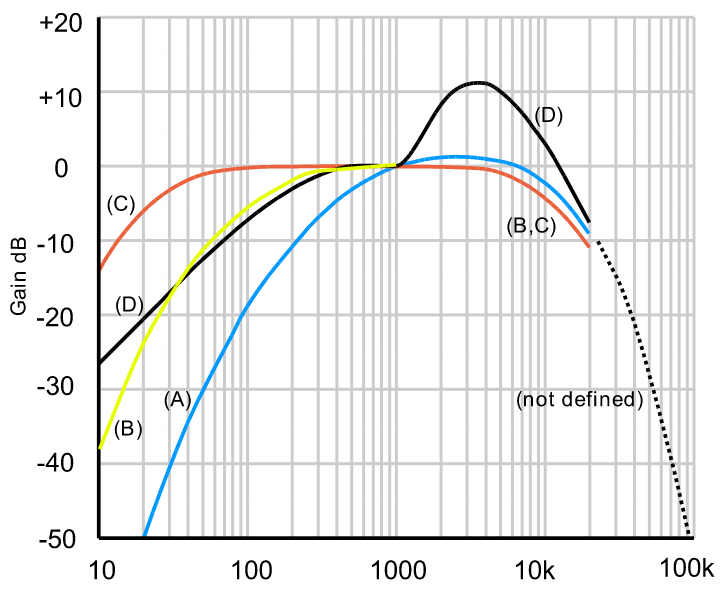

# Messbericht

_Messstation Schwarzach_  
_Durchgeführt von Jakob Tschavoll_  
_NTi-Audio & FH Vorarlberg_

## Allgemeines

Die Messstation "Schwarzach" sammelte aktiv Daten im Zeitraum vom 10.2.22 bis 27.2.22. Ihr Standort in der Anhöhe am Rand des Ortes machen sie geeignet für die Aufnahme von in der Steile anfahrenden Autos und entfernte Geräusche des Industriegebiets, Autobahn und Terminal Wolfurt.

Der Monat Februar 2022 als Messzeitraum besitzt folgende Abweichungen gegenüber typischen Sommermonaten:

- Ungewöhnlich viel Föhnsturm
- Beschneite/nasse Straßen
- Verminderter Motorrad- und Passantenverkehr aufgrund von Kälte

Auch ist es immer hilfreich, eine grobe Referenz auf die Ohren zu haben, auch wenn diese sehr abhängig von Raum, Abstand, Frequenz und subjektiver Wahrnehmung sind.

## Begriffsdefinition

In den Messdaten treten einige Begriffe auf, die erklärt werden müssen. Diese sind Audio-Fachjargon und dienen einer objektiven Bewertung von Pegeln, unabhängig von subjektiven Einflüssen.

| Begriff      | Erklärung                                                                                                                                                                                                                          |
| ------------ | ---------------------------------------------------------------------------------------------------------------------------------------------------------------------------------------------------------------------------------- |
| dB(SPL)      | Einheit des gemessenen Schalldrucks bezogen auf die menschliche Hörschwelle von `2*10^(-5) pascal`. 0 dB bedeutet also, dass man das Geräusch gerade nicht mehr wahrnehmen kann. SPL ist die Abkürzung für "Sound Pressure Level". |
| L            | Level. Deutsch: Pegel. Angabe in dB(SPL)                                                                                                                                                                                           |
| Z            | Z-Gewichtung: Das Geräusch wird so analysiert, wie es für ein Mikrofon unverändert wirkt                                                                                                                                           |
| A            | A-Gewichtung: Das Geräusch wird so analysiert, wie der Mensch **moderaten** Schall wahrnimmt (siehe Grafik 1). Der Mensch nimmt tiefe und hohe Geräusche wenigier laut wahr, als sie physikalisch eigentlich sind.                 |
| C            | C-Gewichtung: Das Geräusch wird so analysiert, wie der Mensch **lauten** Schall wahrnimmt (siehe Grafik 1). Der Mensch nimmt tiefe und hohe Geräusche wenigier laut wahr, als sie physikalisch eigentlich sind.                    |
| LAeq         | A-gewichteter Pegel über eine Zeitspanne gemittelt.                                                                                                                                                                                |
| LAFmax       | A-gewichteter Pegel absoluter Maximalwert.                                                                                                                                                                                         |
| LZeq         | Z-Gewichteter Pegel über eine Zeitspanne gemittelt.                                                                                                                                                                                |
| LCeq         | C-Gewichteter Pegel über eine Zeitspanne gemittelt.                                                                                                                                                                                |
| Spektrogramm | Abbildung eines Geräusches in der Frequenzebene.                                                                                                                                                                                   |

_Grafik 1_

## Numerische Ergebnisse

| Monatsdurchschnitt        | Tagesdurchschnitt typ. (5:00-24:00) | Nachtdurchschnitt typ. (0:00-5:00) | Lautestes Event |
| ------------------------- | ----------------------------------- | ---------------------------------- | --------------- |
|  |                     |                  |    |

**Monatsgraf**

**Tagesgraf (typ.)**

**Häufigste Lärmursachen:**

1. PKW/LKW
2. Zug
3. Wind
4. Tierische Geräusche (Hunde, Vögel)

Das lauteste Geräusch ist ein auf der Messstation landender Vogel, aufgenommen am 23.2.22 um 17:20 Uhr.

## Spektrogramme

Zur Identifikation der Geräusche können Spektrogramme genutzt werden, da diese meist pro Geräusch eine charakteristische Form haben. Am interessantesten sind dabei motorisierte Fahrzeuge und der vorbeifahrende Zug.

**PKW**

**Zug**

