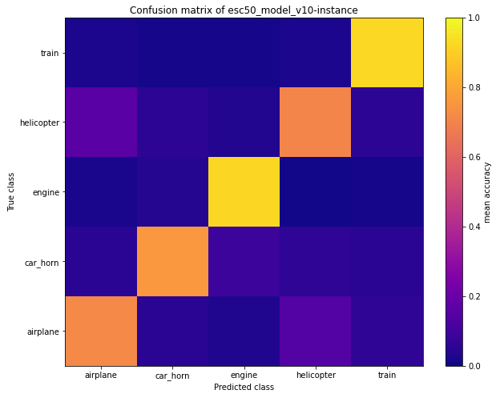
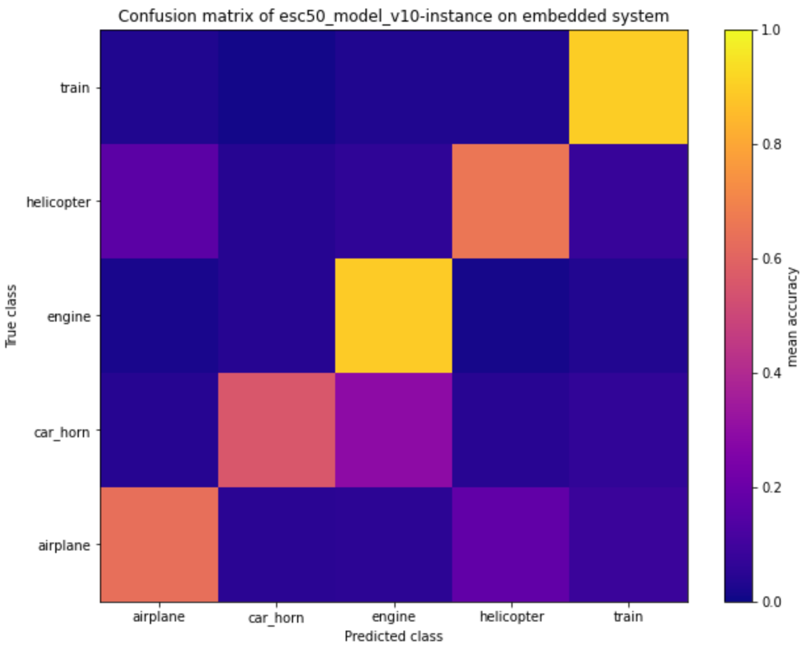
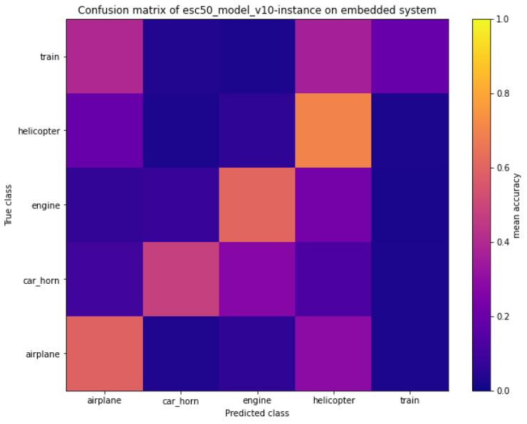
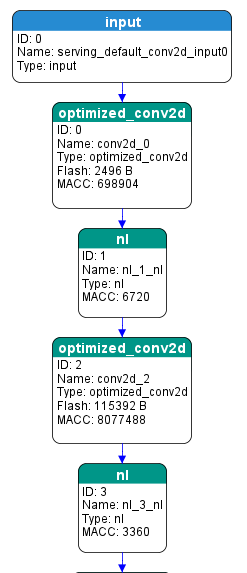
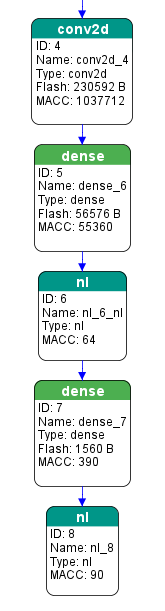
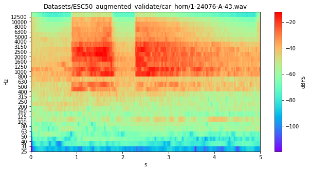
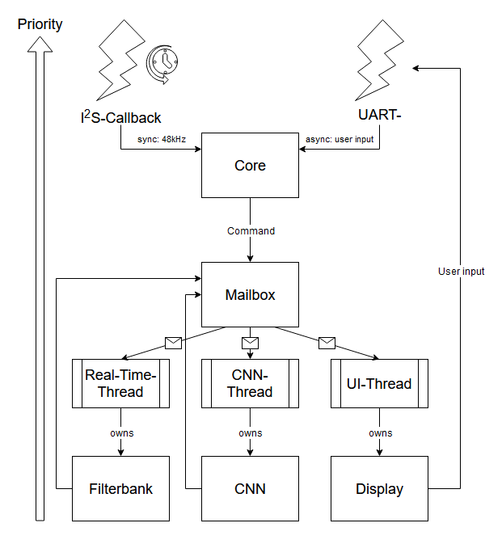

# Project CENES: Classification of Environmental Noise on Embedded Systems

## Abstract

From paper:

*"Greater environmental noise and an increase in motorized vehicles cause a decrease in quality of life for close by residents in many areas. Logging this environmental noise objectively is necessary in order to push forward laws concerning noise regulation, which ensure a healthy environment for humans. To log not only noise levels but noise sources automatically as well, this thesis provides methods for deploying a neural network on an “embedded microcontroller-unit“(MCU) under low-power conditions to identify noise sources (noise classification).*

***Is an embedded system able to process and classify sound on a single chip?***

*The MCU shall be able to handle a “convolutional neural network” (CNN) for audio as well as noise level measurements and pre-processing. This ensures that future devices deploying the same structure can be manufactured cheaply and efficiently, since the entire procedure of audio-sampling up to identification takes place on a single chip. The aim is to identify a small group of traffic-centered noise sources live and without data transfer, cloud-solutions or the presence of an operating system."*

*Keywords:* 

*Embedded systems, audio, acoustics, noise, microphone, DSP, neural networks*

***

## Background

This project with the code-name "`CENES`" (not mentioned in paper for academic reasons) is the practical part of a BSc.-thesis conducted at [FHV](https://www.fhv.at/) (Dornbirn) in cooperation with the Liechtenstein-based company [NTi-Audio](https://www.nti-audio.com/en/) (Schaan). The goal was to evaluate how well a *convolutional neural network* can perform noise classification of traffic noise on an embedded system (not Raspberry Pi), which also holds the data acquisition and filtering on a single chip.

## Key-facts
|Platforms      |Frameworks     |Hardware       |Software       |Goals                  |Results                |
|---------------|---------------|---------------|---------------|-----------------------|-----------------------|
|STM32L5        |STM32CubeIDE   |Nucleo-L5      |STM-HAL C/C++  |Classification on Chip |88% acc. on PC-model   |
|               |X-Cube-AI      |I2S-MEMS-Mic   |X-Cube-AI      |3rd-octave filterbank  |98% ROC-score          |
|               |Tensorflow     |custom HAT     |Jupyter(Python)|Trafic noise detection |                       |      

> Trained on [ESC-50](https://github.com/karolpiczak/ESC-50) (5 classes)!
> * airplane
> * car horn
> * engine
> * helicopter
> * train

## Performance
**Three** tests were conducted with the trained model off and on chip.  
1. Classic inference on PC with wav-files
2. Inference on target device under ideal conditions (soundproof chamber and normed loudspeaker)
3. Inference on target device under non-ideal conditions (living room with home-stereo)

<figure>
    
    <figcaption>C-matrix from PC</figcaption>
</figure>
<figure>
    
    <figcaption>C-matrix from device (ideal)</figcaption>
</figure>
<figure>
    
    <figcaption>C-matrix from device (non-ideal)</figcaption>
</figure>

## Structure

### CNN
The employed CNN was self-trained and is based on a [publication](https://arxiv.org/pdf/1608.04363.pdf) by Justin Salamon and Juan Pablo Bello. It employs convolutional filters onto 3rd-octave-filter-extracted features, which are very fast to calculate. In this first version, no hopping is introduced yet and a window of one second is classified. The filters follow the `IEC 61260` standard center and cutoff frequencies but in a shorter band ranging from 25 to 12500 Hz. This is based on the assumption that frequency content below and above don't contribute much to the quality of classification of traffic noise.

<figure>
    
    <figcaption>Graph of CNN (generated by X-Cube-AI)</figcaption>
</figure>
<figure>
    
    <figcaption>Graph of CNN (generated by X-Cube-AI) cont.</figcaption>
</figure>

The data augmentation and feature extraction for training data is done via the modules [augmolino](https://github.com/jake-is-ESD-protected/augmolino) and [octafilt3r](https://github.com/jake-is-ESD-protected/octafilt3r). Together they produce blocky spactrograms, which have to following benefits:
* Low data rates
* Protection of privacy (spectrogramms are too rough to be transformed back)
* Require less CNN-inputs that traditional feature extractions

<figure>
    
    <figcaption>3rd-octave spectrogram with octafilt3r</figcaption>
</figure>

### Embedded software
The embedded software is written in C/C++ in the STM32CubeIDE for the target device Nucleo-L5. Together with FreeRTOS a precise sampler, filtering and inferencing via X-Cube-AI can be achieved.
<figure>
    
    <figcaption>embedded software architecture</figcaption>
</figure>

## Images